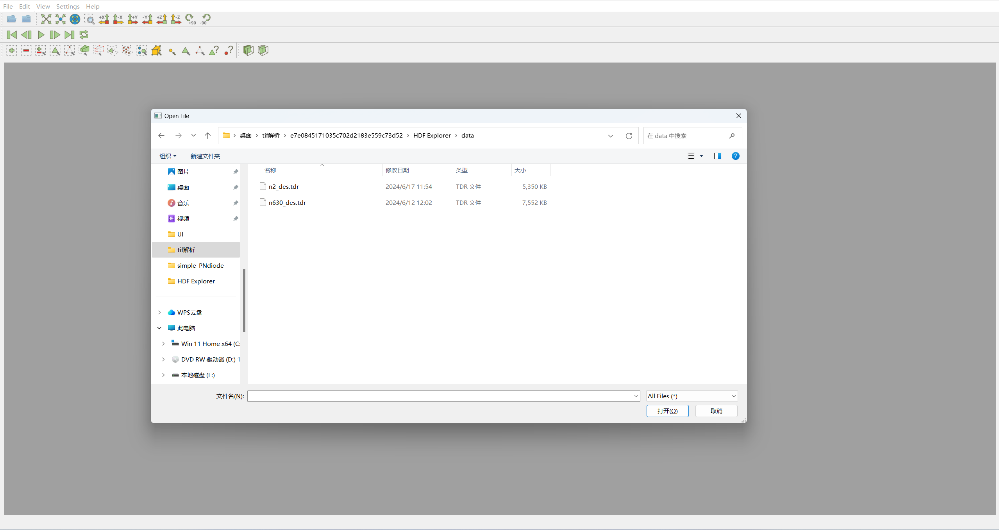
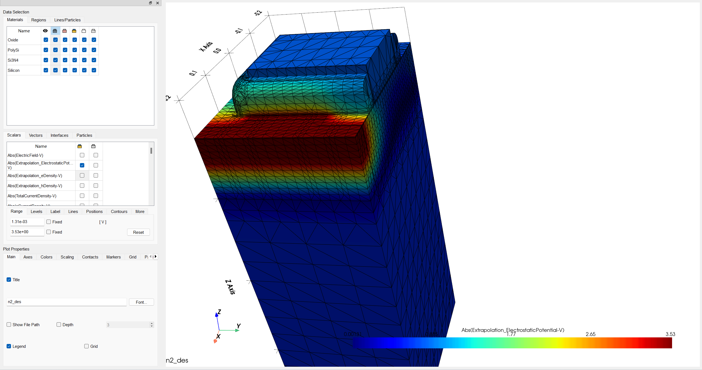
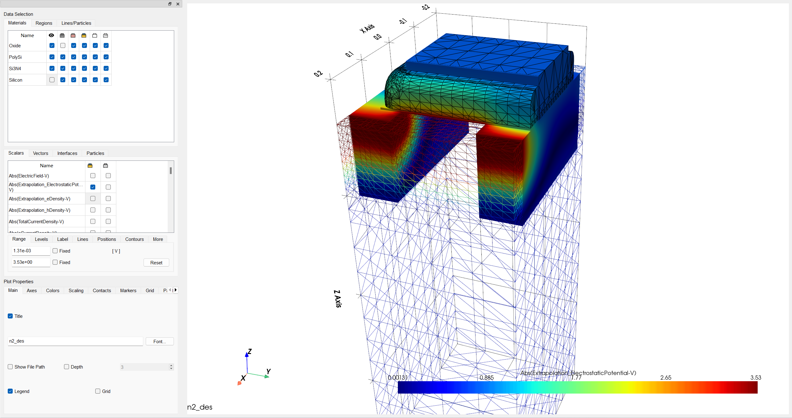
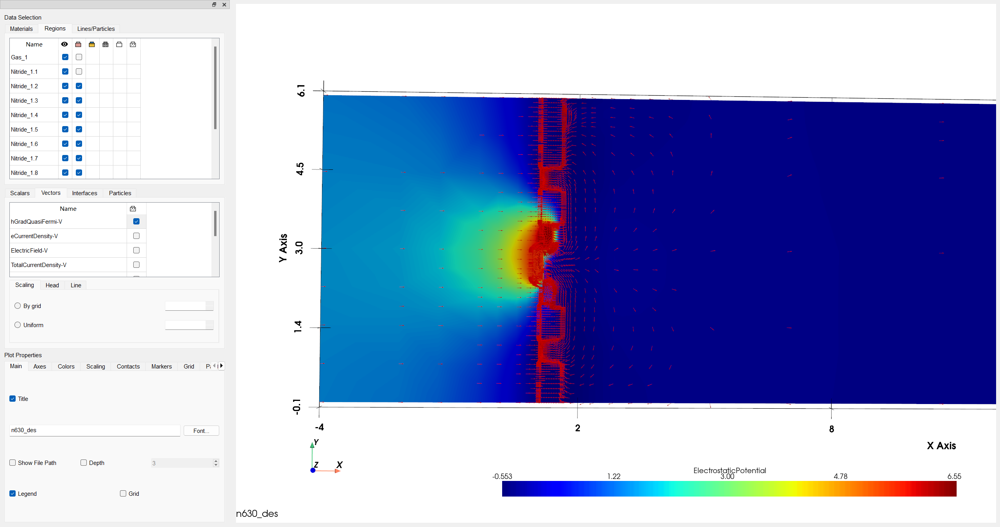
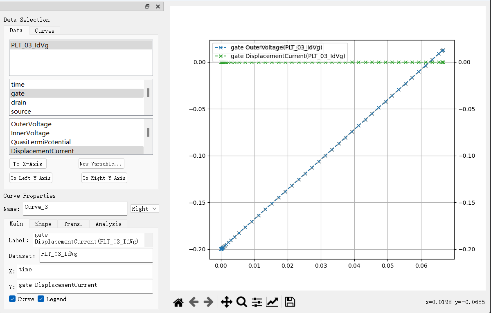
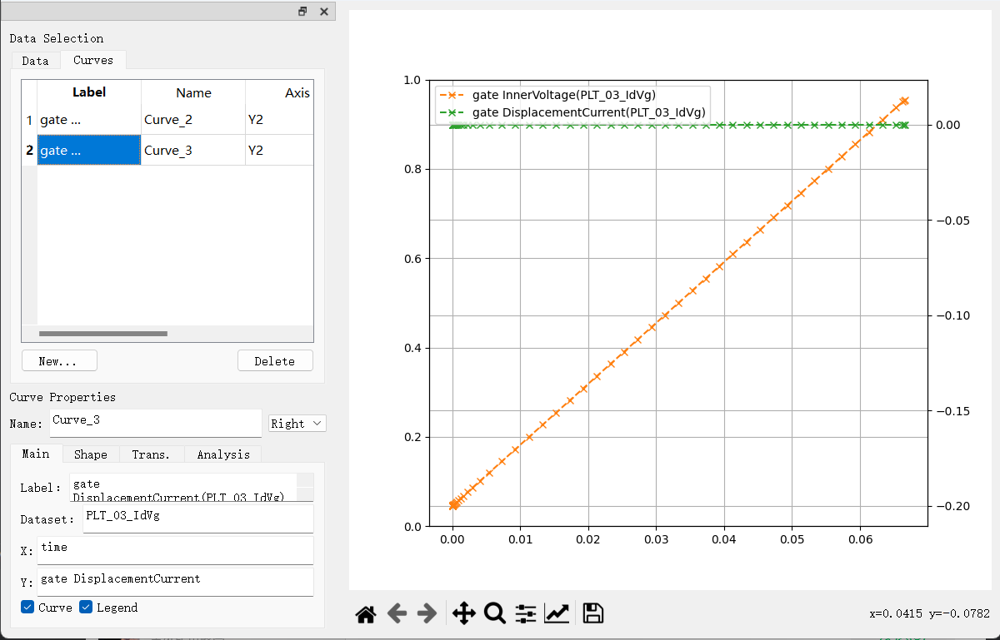
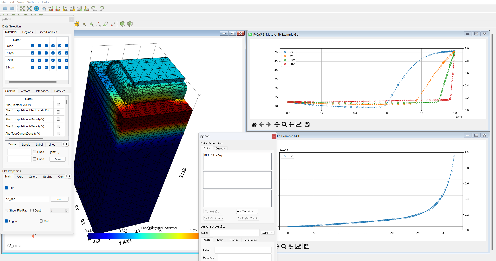

# TDRDisplayer

## 1. 简介
Sentaurus的TDR（Technology Data Report）文件是一种用于记录和存储仿真结果和相关数据的格式。TDRDisplayer是一个用于显示TDR文件内容的软件，可以将TDR文件中的数据以二维或者三维的形式展示出来。

## 2. 示例

### 2.1 打开文件（支持tdr,vtk,bnd,tif,plt等格式）

### 2.2 三维场数据显示

### 2.3 区域状态改变

### 2.4 二维场数据显示(vector)

### 2.5 二维曲线数据显示

### 2.6 二维曲线数据显示

### 2.7 总览

## 3. 说明

本软件旨在替代Sentaurus自带的TDR文件查看器，提供更加友好的界面和更加丰富的功能。

